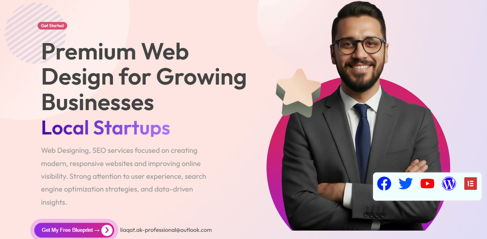
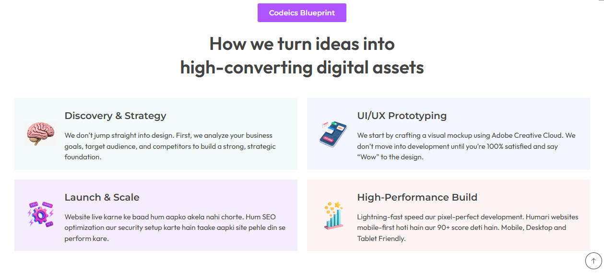
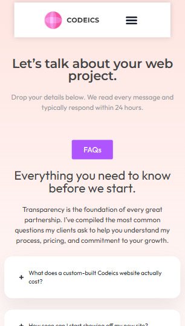

<h1>🚀 WordPress Websites That Look Premium & Convert Better</h1>

I help brands, startups, and local businesses build <b>fast</b>, <b>modern</b>, and <b>mobile-optimized</b> WordPress websites using Elementor.

  
  

  
  
  
  
  
  

---

## 💼 What I Can Build For You

- ✅ Business Websites (service-based companies, agencies, personal brands)
- ✅ High-converting Landing Pages (lead generation focused)
- ✅ WooCommerce Stores (shop, product, cart, checkout pages)
- ✅ Website Redesigns (modern UI/UX + better structure)
- ✅ Performance Optimization (faster loading, cleaner assets)
- ✅ On-page SEO Basics (meta setup, heading structure, sitemap support)

---

## 🧩 Featured Work

### Portfolio Website (Elementor)
**Goal:** Premium business presence with strong trust and clear CTA.  
**Delivered:** Hero section, services, contact flow, responsive polish.

  
  
  

---

> ## 🎁 Exclusive Offer for New Clients  
> **Get up to 20% OFF on hosting** when you purchase through my recommended links.  
> If you’re confused between options, I’ll personally suggest the best host based on your budget and project type.

## 🛠️ Recommended Tools

<table>
  <tr>
    <td align="center" width="33.33%">
      
       
      Compare plans for blogs, business sites, and client projects.
    </td>
    <td align="center" width="33.33%">
      
       
      Managed WordPress hosting focused on speed and security.
    </td>
    <td align="center" width="33.33%">
      
       
      Scalable cloud servers for growing websites and apps.
    </td>
  </tr>

  <tr>
    <td align="center" width="33.33%">
      
       
      Drag-and-drop builder for modern WordPress pages.
    </td>
    <td align="center" width="33.33%">
      
       
      WordPress security, backups, and maintenance tools.
    </td>
    <td align="center" width="33.33%">
      
       
      Create and sell online courses with WordPress LMS.
    </td>
  </tr>

  <tr>
    <td align="center" width="33.33%">
      
       
      Grow long-term organic traffic using Pinterest strategy.
    </td>
    <td align="center" width="33.33%">
      
       
      Need help? Order your WordPress project on My Website.
    </td>
    <td align="center" width="33.33%">
       
    </td>
  </tr>
</table>

---

## ⚙️ My Work Process

1. **Discovery Call** — understand goals, pages, audience, brand style  
2. **Structure & Wireframe** — clean page flow for clarity and conversions  
3. **UI Build in Elementor** — modern visual design with responsive layout  
4. **Optimization** — speed, spacing, mobile polish, on-page SEO basics  
5. **Launch & Handover** — final QA + guidance for content updates

---

## 📩 Ready to Start Your Website?

  

© 2026 Liaqat Ali Khan • WordPress & Elementor Web Designer • Client-Focused Delivery

